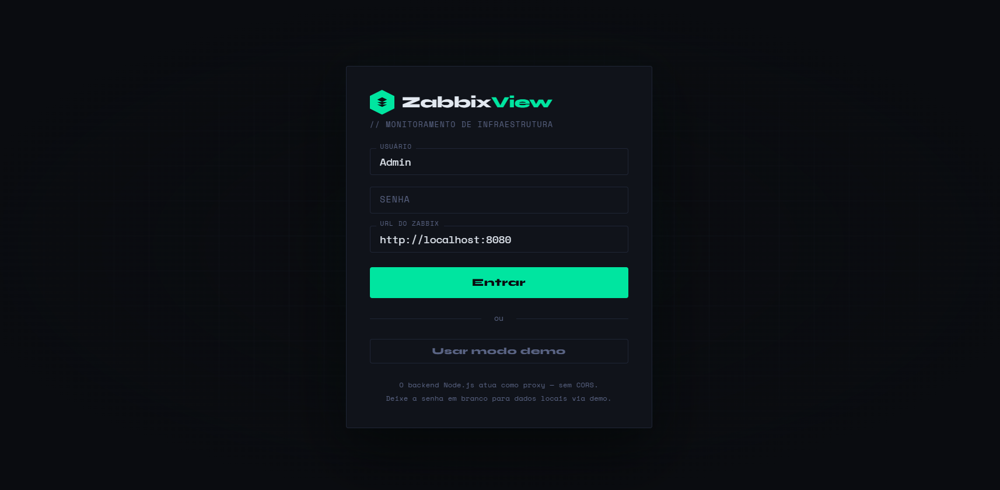
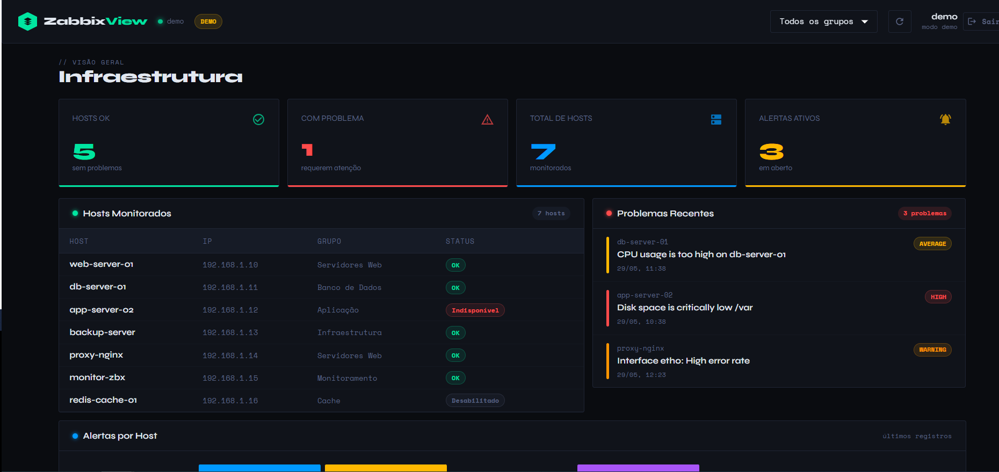

# ZabbixView

> Dashboard de monitoramento de infraestrutura com integração à API do Zabbix — desenvolvido com React + TypeScript no frontend e Node.js no backend.

---

## 📸 Screenshots

### Tela de Login

*Autenticação com suporte a usuário/senha e URL do Zabbix, ou modo demo para testes sem instância real.*

### Dashboard — Visão Geral

*Painel principal com total de hosts monitorados, status de disponibilidade, alertas ativos por severidade e lista de problemas recentes em tempo real.*

---

## 🧩 Sobre o Projeto

O **ZabbixView** nasceu da necessidade de ter uma interface alternativa, moderna e limpa para visualizar dados do Zabbix sem depender do frontend oficial.

A aplicação conecta-se à **API JSON-RPC do Zabbix** via um proxy Node.js (resolvendo o problema de CORS) e exibe:

- Status de todos os hosts monitorados (OK / Indisponível / Desabilitado)
- Contagem de hosts com problema
- Alertas ativos com classificação por severidade (Warning, Average, High, Disaster)
- Problemas recentes com host de origem e timestamp
- Filtro por grupos de hosts
- **Modo demo** com dados mockados para apresentação sem Zabbix instalado

---

## 🏗️ Arquitetura

```
Browser (React/Vite :5173)
        │
        │  fetch /api/zabbix/call
        ▼
Node.js + Express (:3001)      ← proxy sem CORS
        │
        │  axios POST
        ▼
Zabbix API (api_jsonrpc.php)
```

O backend resolve o CORS — o browser nunca fala diretamente com o Zabbix.

---

## 🗂️ Estrutura do Projeto

```
zabbixview/
├── backend/
│   ├── src/
│   │   ├── routes/        # Proxy Zabbix + dados demo
│   │   └── index.ts       # Express app
│   ├── .env.example
│   └── package.json
└── frontend/
    ├── src/
    │   ├── pages/         # Login, Dashboard
    │   ├── components/    # Cards, tabelas, alertas
    │   └── services/      # Integração com a API
    └── package.json
```

---

## 🚀 Como Rodar

### Pré-requisitos
- Node.js 18+
- npm

### 1. Backend

```bash
cd backend
cp .env.example .env
npm install
npm run dev
# Servidor rodando em http://localhost:3001
```

### 2. Frontend

```bash
cd frontend
npm install
npm run dev
# Abre em http://localhost:5173
```

---

## 🔑 Login

| Campo   | Valor                          |
|---------|-------------------------------|
| Usuário | `Admin` (ou seu usuário Zabbix) |
| Senha   | sua senha                      |
| URL     | `http://localhost:8080`        |

Ou clique em **"Usar modo demo"** para testar sem Zabbix.

---

## 🔌 Endpoints do Backend

| Método | Rota                   | Descrição                              |
|--------|------------------------|----------------------------------------|
| POST   | `/api/zabbix/call`     | Proxy genérico para a API Zabbix       |
| GET    | `/api/demo/data`       | Dados mockados para demonstração       |
| GET    | `/health`              | Health check                           |

---

## 🛠️ Stack

| Camada    | Tecnologias                                             |
|-----------|---------------------------------------------------------|
| Frontend  | React 18, TypeScript, Vite, Material UI 5, React Router 6, Axios |
| Backend   | Node.js, TypeScript, Express 4, Axios, tsx (hot reload) |

---

## 👤 Autor

**Lucas Willian Cazuza Ferro**  
Analista de TI · Zabbix · Node.js · React  
[LinkedIn](https://linkedin.com/in/lucaswill07) · [GitHub](https://github.com/cazuza97)
